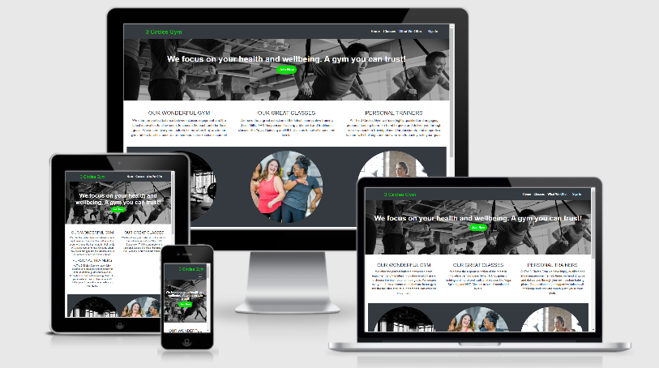

# 3 Circles Gym 
#### A link to the site can be found [here.](https://marcjph.github.io/Milestone-Project-1/)

#### User Centric Front End Development Project - Code Institute

#### The project is to deliver a new and engaging front end site for the 3 Circles Gym that allows current and potential members to view details of the gym facilities, what the gym can offer to them and the benefits of becoming as a member.
#### The site will encompass all that is on offer for existing members and why they should continue with their membership but also attract and encourage non-members who are visiting the site to sign up. This will be done via providing clear information on what members can use at the gym through text and visuals in addition to the benefits of what an active lifestyle can promote with motivational content. The site will be simple to navigate whilst providing the opportunity on each page to sign up to encourage the site visitors to do so.

### **User Experience**

The website is for 3 Circles Gym, a relatively new gym which is a small independently run business in Cowdenbeath, Fife who want to ensure they can retain current members in a very competitive industry but to also attract new members. The site that has been created for them will help achieve their goals by being visually appealing, using emotive pictures and icons but will be straight forward to use and intuitive. It will be consistent across the different pages and be simple in design to ensure users can navigate around the site easily. The site will allow visitors to immediately understand what is on offer and how they can join.

#### User Stories

A number of User Stories were documented to help achieve the user experience that has been created.

Gym Owner:

1. As the gym owner, I want for visitors to have all the information they are looking for and to make the gym experience they would have at my gym appealing, so that they sign up to join as a member to increase my turnover.
2. As the gym owner, I want to make signing up to become a member as simple as possible, so that users are encouraged to sign up straight away.
3. As the gym owner, I want current members who visit the site to see the benefits of an active lifestyle and of being a valued customer, so they retain their membership and continue visiting the gym.

Gym Member:

1. As a gym member, I want to know what type of classes are available and when, so I can join and enjoy a varied exercise regime.
2. As a gym member, I want to be reminded of what benefits there are of being a member and feel that the gym value my membership, to help me confirm that I should continue my membership rather than move to a competitor.
3. As a gym member, I want to know what personal trainer options there are, so I can decide if that is something I would want to pursue.

Prospective Member:

1. As someone interested in becoming a member, I want to know how much memberships costs, so I can decide if I can afford to join.
2. As someone interested in becoming a member, I want to know what equipment the gym has for exercise, so I can decide if the equipment available suits my needs.
3. As someone interested in becoming a member, I want to know what instructor led classes are available, so I can decide if the classes would be of interest if I joined.
4. As someone interested in becoming a member, I want to know what changing facilities are on site, so I can understand if I can work going to the gym into my current life and commitments.

#### Wireframes

 - [Index Page](wireframes/index.png)
 - [Classes](wireframes/classes.png)
 - [What We Offer](wireframes/whatweoffer.png)
 - [Sign Up Form](wireframes/signupform.png)

#### Features

Existing Features:

- The Home Page contains a **hero image** to immediately provides visitors to the site of a visual of the gym. There is also a Call to Action button within the image to give users the ability to sign up as a member.
- The **Join Now** button, located twice on each page except for the What We Offer page where it has the one Join Now button for mobile devices for better UX, allows users to sign up to be a member, by filling out a joiners form that appears on page once the button is selected.
- A **menu option** in the top right of the screen allows users to navigate through the site to view the different information located within the site.
- There are **3 circular pictures** within each page that promotes the gym and the gym experience whilst also linking to the name of the gym.
- A **timetable** is located on the Classes page to provide users with what classes are available and when. The page also contains testimonials from current members to help give prospective members an idea of the benefits of joining.
- The What We Offer page provides some detail on what members can use and enjoy from the gym while also including a map showing the location of the gym. There are 3 motivational quotes within the page to, again, encourage users to start or maintain an active lifestyle.
- The **NAV bar** contains the 3 Circles Gym brand name which is also a link to the home page. Also within the NAV bar is the **Sign In** link for existing members.
- The footer is consistent on each page showing when the gym is open and the address. It also has a contact email address, phone number and the links to the social networks for the gym.

Features Left to implement:

- How many users are in the gym currently, which allows users to know how busy the gym is so they can decide if they want to go now or potentially later.
- A menu that provides the detail on each class that is available in the gym.
- Use an Image CDN or other type of image optimisation tool to allow for smaller images to be used for mobile devices. This will improve performance on these types of devices.

### Technologies Used

* HTML5
* CSS
* [Bootstrap 4.6](https://getbootstrap.com/docs/4.6/getting-started/download/)
    * The project uses Bootstrap 4.6 to aid the structure and the responsiveness of the site. 
* [Fontawesome](https://fontawesome.com/)
    * Fontawesome is used to provide the icons that are displayed throughout.
* [Google API](https://console.developers.google.com/getting-started)
    * The API is used to interface to Google Font (https://fonts.google.com/) which is used throughout the site and also to embed a map on one of the pages.
* [Jquery](https://jquery.com/)
    * Jquery is used for the Javascript elements used within the project.
* [Popper.js](https://popper.js.org/)
    * Popper.js was used to reference Javascript.

### Testing

The following testing was performed to test functionality, browser compatibility, responsiveness and that the user stories documented above are fulfilled by the completed site.

#### Functionality

Test | Action | Expected Outcome | Test Outcome |
---- | ------ | ---------------- | ------------ |
Menu links on top navbar | Select the links on each of the 3 main pages | When link was selected, the site would move to that page | PASS
Sign In link | Select the "Sign In" link on top menu | The Sign In form would appear and allow access to enter credentials | PASS
Company logo/name is link to index.html page | Select the 3 Circles Gym name on top menu | No matter what page user was on, it would take them to the Index/home page | PASS
Join Now buttons | Select the Join Now buttons on each page | The form would appear and allow access to enter credentials to sign up to the gym | PASS
Social Media links | Select each of the social media icons | That a new tab would open with the selected social media home page showing | PASS
Sign In Form | After selecting the "Sign In" link, enter email address and password | Email address and password entered and form submitted with no errors | PASS
Join Now Form | After selecting the "Join Now" button, enter credentials to sign up to the gym | All fields could be completed and selected and form submitted with no errors | PASS
Form Validation - Sign In | Enter incorrect values in form | The form would notify that incorrect values were entered and form cannot be submitted | PASS
Form Validation - Join Now | Enter incorrect values in form | The form would notify that incorrect values were entered and form cannot be submitted | PASS
App store links | Select each app store link | The select app store will open in a new tab | PASS
Hovering over links and buttons | Hover over links and buttons | When hovering over these elements, they should change colour or change visually | PASS
Menu collapses for mobile devices | Review site on a mobile device and view menu | The top menu should collapse into a clickable drop down menu | PASS

#### Browser Compatibility

The website has been tested on the following browsers:
 - Chrome (version 88.0.4324.190)
 - Edge (version 88.0.705.81)
 - Firefox (version 86)

The website has been tested on the following mobile devices:
 - Iphone 6s Safari (IOS 14.2)
 - Huawei P Smart 2020
 - Samsung Galaxy A20
 - Ipad (IOS 10.3.3)

#### Performance

Performance of the website was tested using the Lighthouse function as part of Google developer tools. The first run on the desktop reported performance could have been quicker. 3 images were compressed to reduce their size which increased the performance by 11.

 - [Lighthouse Test 1](testingoutput/performancetest1.png)
 - [Lighthouse Test 2](testingoutput/performancetest2.png)

It was also run for mobile which resulted in a performance score of 77. This needs to be addressed as part of the next release to ensure a good user experience when accessing the site on mobile devices.

 - [Lighthouse Test Mobile](testingoutput/performancetestmobile.png)

Both the desktop and mobile tests reported a good score for accessibility and best practices however both need to improve their score for SEO. Again, this would be addressed in the next release.

#### Responsiveness

The website is working well across different screen sizes. The 3 circle images that are presented across each page drop off on mobile devices as expected. All images across the website work well for large and small screens. The main text in the callout sections on each page reduce in size for mobile devices.

#### User Stories Test

The website was tested against the user stories for the three stakeholders stated above with the following results.

#### Gym Owner:
The site defines what kind of gym experience users would receive at the gym while also making it straight forward to sign up and become a member. Current members also have visibility of what is on offer and why they should retain their membership.

#### Gym Member:

When and what type of gym class is clearly identifiable while an introduction for personal training is available on the site and it directs them to the gyms app to book the sessions.  The benefits of having an active lifestyle at the gym is noted through each page to highlight to the current members why they should retain their membership.

#### Prospective Member:

The costs of each membership type available are clearly visible for visitors while the equipment and class information is also laid out. The facilities are also mentioned to make visitors aware of what is available.

#### Defects Found during testing:

1. Menu collapsed into drop down menu however when selected no menu appeared.
 - This was due to the javascript from Bootstrap missing from the html pages. This was added and resolved the issue.

2. Sign In form was not appearing on mobile devices.
 - This was due to the data toggle and data target code not being included in the list item for the sign in when it was in the drop down menu. data-toggle="modal" data-target="#signinmodal" were added.

3. The student option was included with concessions/NHS workers in the Sign Up form incorrectly as it had a different membership price to the other two.
 - A new option for Student was added to the Join Now form.

4. The Corporate membership was available to be selected in the Join Now form but did not have a price on the Membership table in the What We Offer page.
 - Corporate Membership was added to the table in the whatweoffer.html page.
    
    

### Deployment

This project was developed using GitPod where it is hosted using GitHub pages.

The website was deployed to GitHub pages via the below procedure:

1. Log into **GitHub**.
2. Locate and select the repository named [MarcJPH/Milestone-Project-1](https://github.com/MarcJPH/Milestone-Project-1).
3. Near the top of the page select the **Settings** menu option.
4. Scroll down the page until you come to the **The GitHub Pages** section, which is found near the bottom of the page.
5. Under Source, change the drop-down menu where None is labelled to **Master Branch**.
6. This deploys the website and creates a link for the website in the GitHub pages section.

The website will automatically update when commits and push's to the master branch are performed. The steps that are required for this to happen are:

1. Within **GitPod**, if the terminal window is not open at the bottom of the page, select Terminal in the top menu and select New Terminal.
2. Actions and instructions can be typed within the terminal at the bottom of the page, where it states gitpod /workspace/"nameofproject" $.
3. To commit changes or additions to the code made within GitPod, type **'git commit -m "add comment in here of what has been changed."'** then Enter.
4. To push the changes so they are sent to GitHub Pages automatically, in the next line in the terminal type **'git push'**. The terminal will run and push the code. If any errors or issues have arose, they will be stated in the terminal message after your command.

#### Running the Project Locally

To run the project locally you will have to clone it first. Follow the below steps to perform the clone:

1. Within **GitHub**, locate and select the repository named **MarcJPH/Milestone-Project-1**.
2. When within the main page of the repository, select the **Code** button which can be found above the list of files section.
3. Select the option of **"Clone with HTTPS"** and then select the copy button which is the clipboard icon.
4. Go to **Workspaces** within GitPod and select the location where you want to place the cloned directory.
5. In the terminal window, type **"git clone"** and then paste the url that was copied from the directory within GitHub. Then press **enter**.
6. Upon pressing enter, the local clone of the directory will be made.

### Credits

#### Media

Most of the photos displayed on the project were sourced from the website [Unsplash](https://unsplash.com/) :
 - gymhero.png Photo taken from [Fitness First.com](https://www.fitnessfirst.com.my/-/media/project/evolution-wellness/fitness-first/south-east-asia/malaysia/classes/fgt-hiit/fgt-hiit_fb-sharing.png)
 - ourgym.jpg Photo by Risen Wang on Unsplash
 - feelgreat.jpg Photo taken from [Popsugar-assets.com](https://media1.popsugar-assets.com/files/thumbor/5EKQofgcc8xAuFy8ca5KcEECg0A/fit-in/1024x1024/filters:format_auto-!!-:strip_icc-!!-/2019/02/06/052/n/1922729/53927cc45c5b78829321d3.24361415_/i/Best-Dance-Workout-Videos.jpg)
 - positive.jpg Photo by bruce mars on Unsplash
 - gymclass1.jpg Photo by Geert Pieters on Unsplash
 - gymclass2.jpg Photo by Dylan Gillis on Unsplash
 - gymclass3.jpg Photo taken from [Content Active.com](https://content.active.com/Assets/Active.com+Content+Site+Digital+Assets/Fitness/580x350/Secrets+of+People+Who+Love+to+Work+Out/Secret+8.jpg)
 - motivation.jpg Photo by John Arano on Unsplash
 - motivation2.jpg Photo by Jesper Aggergaard on Unsplash
 - happyexercise.jpg Photo by Wavebreakmedia Ltd on Getty Images
 - equipment.jpg Photo by Danielle Cerullo on Unsplash
 - personaltrainer.jpg Photo by Jonathan Borba on Unsplash
 - lockers.jpg Photo by Jan Laugesen on Unsplash

#### Code

 - Code for customising the borders within a Bootstrap table was taken from [Stackoverflow](https://stackoverflow.com/questions/45746103/boostrap-css-change-table-border-colors)
 

##### Disclaimer
The content of this Website is for educational purposes only.

